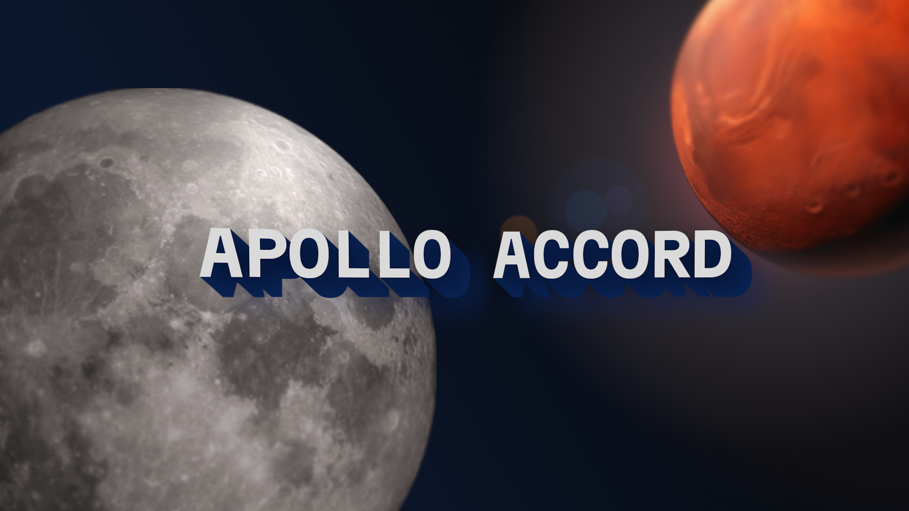

# The Great Abyss is Waiting...

**Explore deep space and connect with alien civilizations in Apollo Accord.**

> [!IMPORTANT]
> This game is not finished. Major changes may occur.

## Features

- Built on Unity.
  Quality graphics and mind-blowing scales to come.
  
- Immersive exploration.
  Space is waiting. Board your ship or send envoys to discover new planets or civilizations.
- RPG-like features.
  Connect with procedurally generated aliens to trade, fight or thrive.

## Platforms

> [!IMPORTANT]
> Not finalized.

- Windows
- macOS
- Linux
- Web Version (maybe)

## Contributing
I am making this game as part of the *Stardance* ysws event held by Hackclub. While I appreciate
your willingness to contribute, I will have to decline any pull requests for now. I want to have
full control over this project for the time being.

> [!NOTE]
> I will reconsider once Stardance ends, or I finish developing this project.

## Credits

### Main Inspirations
Movies like: *Interstellar*

Games like: *Starfield* (Ok I take that back, ***fan made*** *Starfield*)

### Tools Used

> [!NOTE]
> Tools may be added later on.

- 
  *Used for textures and promotions*
- 
  *Game Engine. Used plugins such as ProBuilder, animations and UI (Canvas)*

### Assets Source

> All assets used are either public domain (CC Zero) or made by me.
- 
  *Specifically the font(s): Martian Mono*
- 
  *Mainly for sound fx*
- **Generous users on Reddit**
  *Example: Space Skybox*

### Usage of AI

Places that used AI:
- Character Voices (Not yet)
- Assistance of scripting code (GitHub Copilot, <10% of code is AI-assisted or generated)
- Learning Unity (Google Search Summaries A.K.A. Google Gemini)
